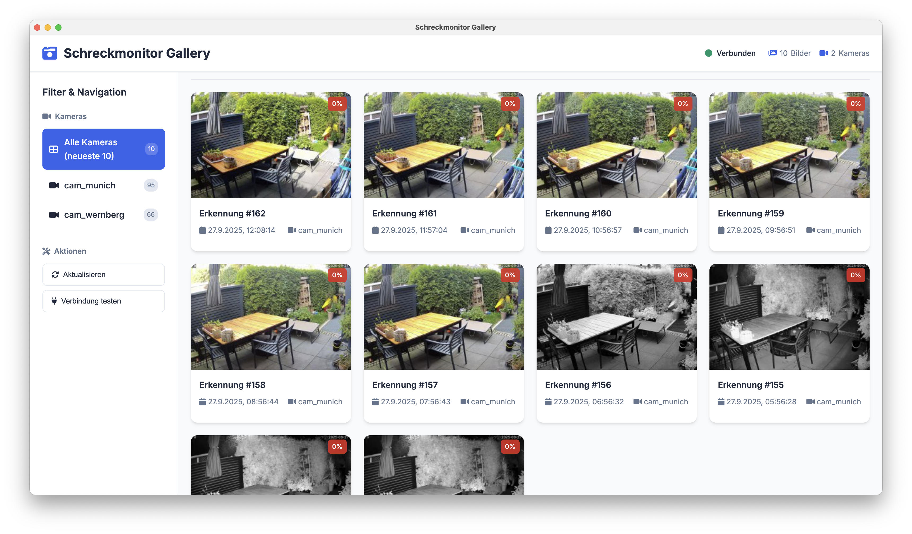

# Schreckmonitor Gallery

A modern Electron desktop application for viewing and managing cat deterrent detection images from a MariaDB database.



## Features

- 🖼️ **Modern Image Gallery** - Grid and list view
- 🔍 **Advanced Filtering** - By camera and time period
- 📊 **Statistics** - Overview of detections and cameras
- 🗃️ **Database Integration** - Direct connection to MariaDB
- 🎨 **Responsive Design** - Works on various screen sizes
- ⚡ **Performance** - Optimized for large image collections with thumbnail support
- 🔒 **Security** - Secure IPC communication between processes

## System Requirements

- Node.js 16 or higher
- MariaDB Server
- Windows 10/11, macOS 10.14+ or Linux

## Installation

1. **Clone Repository**
   ```bash
   git clone <repository-url>
   cd schreckmonitor
   ```

2. **Install Dependencies**
   ```bash
   npm install
   ```

3. **Configure Database Connection**
   
   Copy the example configuration and adapt it:
   ```bash
   cp config.example.js config.js
   ```
   
   Edit `config.js` with your database credentials:
   ```javascript
   module.exports = {
       database: {
           host: 'localhost',
           port: 3306,
           user: 'your_username',
           password: 'your_password',
           database: 'cat_deterrent'
       }
   };
   ```

4. **Set Environment Variables (optional)**
   
   Alternatively, you can use environment variables:
   ```bash
   export DB_HOST=localhost
   export DB_PORT=3306
   export DB_USER=your_username
   export DB_PASSWORD=your_password
   export DB_NAME=cat_deterrent
   ```

## Usage

### Start Development Mode
```bash
npm run dev
```

### Start Production Version
```bash
npm start
```

### Build App
```bash
npm run build
```

## Database Schema

The application expects a MariaDB table with the following schema:

```sql
CREATE TABLE `detections_images` (
    `id` INT NOT NULL AUTO_INCREMENT,
    `timestamp` TIMESTAMP NOT NULL DEFAULT CURRENT_TIMESTAMP,
    `camera_name` VARCHAR(50) NOT NULL,
    `accuracy` DECIMAL(3,4) NOT NULL,
    `thumbnail_jpeg` MEDIUMBLOB,
    `blob_jpeg` MEDIUMBLOB NOT NULL,
    PRIMARY KEY (`id`)
) ENGINE=InnoDB;
```

**Note:** The `thumbnail_jpeg` column is used for fast gallery loading, while `blob_jpeg` contains the full-size image displayed in the modal view.

## Features in Detail

### 📸 Image Gallery
- **Grid View**: Clear display of all detections in a grid layout
- **List View**: Compact display with additional information
- **Sorting**: By date, accuracy, or camera
- **Thumbnail Optimization**: Fast loading with thumbnail previews and full-size modal view
- **Lazy Loading**: Optimized performance for large image collections

### 🔍 Filter Options
- **All Cameras**: Shows all detections
- **By Camera**: Filters detections from a specific camera
- **Accuracy Display**: Color-coded badges for different accuracy levels

### 📊 Statistics
- Total number of detections
- Number of active cameras
- Timestamp of newest and oldest detection

### 🛠️ Management
- **Delete Detection**: Individual detections can be deleted
- **Connection Test**: Database connection verification
- **Refresh**: Manual data refresh

## Project Structure

```
schreckmonitor/
├── assets/                 # App resources (Icons, etc.)
├── database/              # Database modules
│   └── db-manager.js      # MariaDB connection manager
├── renderer/              # Frontend files
│   ├── index.html         # Main HTML file
│   ├── styles.css         # CSS styling
│   └── script.js          # Frontend JavaScript
├── main.js                # Main process (Electron)
├── preload.js             # Preload script for secure IPC
├── package.json           # Project configuration
├── config.example.js      # Example configuration
└── README.md              # This file
```

## Development

### IPC Communication
The app uses Electron's IPC (Inter-Process Communication) for secure communication between the main process and renderer process.

**Available APIs:**
- `getDetections()` - Retrieve all detections (thumbnails)
- `getDetectionsByCamera(cameraName)` - Filter detections by camera
- `getCameras()` - Get available cameras
- `getFullImage(id)` - Load full-size image for modal view
- `deleteDetection(id)` - Delete detection
- `testDbConnection()` - Test database connection

### CSS Variables
The design uses CSS Custom Properties for easy customization of colors and spacing:

```css
:root {
    --primary-color: #2563eb;
    --success-color: #059669;
    --error-color: #dc2626;
    /* ... more variables */
}
```

## Troubleshooting

### Database Connection Failed
1. Check the connection data in `config.js`
2. Ensure the MariaDB server is running
3. Check firewall settings
4. Use the "Test Connection" button in the app

### App Won't Start
1. Check Node.js version (`node --version`)
2. Delete `node_modules` and run `npm install` again
3. Check console for error messages

### Images Not Displaying
1. Verify that the `thumbnail_jpeg` and `blob_jpeg` columns contain valid JPEG data
2. Check database permissions
3. Look in Developer Tools (F12) for JavaScript errors
4. Ensure both thumbnail and full-size image data are present in the database

## Performance Notes

- **Thumbnails**: The app loads thumbnails first for fast gallery browsing
- **Full Images**: Full-size images are loaded on-demand when opening the modal
- **Database Optimization**: Consider adding indexes on `timestamp` and `camera_name` columns for better performance

## License

MIT License - See LICENSE file for details.

## Contributing

Contributions are welcome! Please create a Pull Request or open an Issue for suggestions.

## Support

For questions or issues, please create an Issue in the repository or contact the developer.
